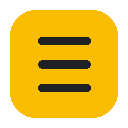

<p align="center">
  
</p>

<h1 align="center">NotebookLM++</h1>

<p align="center">
  <strong>RU</strong> | <a href="#english">EN</a>
</p>

<p align="center">
  Chrome-расширение-компаньон для <a href="https://notebooklm.google.com">NotebookLM</a>.<br>
  Добавляйте веб-страницы, YouTube-видео, шортсы, комментарии и целые плейлисты прямо в нотбуки.
</p>

<p align="center">
  
  
  
</p>

---

## Возможности

**Импорт**
- Добавление текущей страницы в нотбук одним кликом
- Захват страницы как PDF через Chrome Debugger API
- Создание новых нотбуков прямо из расширения

**YouTube**
- Видео, плейлисты, каналы целиком
- YouTube Shorts (одиночные и вкладка Shorts канала)
- Парсинг комментариев (топ/новые + ответы) как текстовый источник

**Инструменты**
- Массовый импорт ссылок
- Импорт открытых вкладок браузера
- Массовое удаление источников из нотбука
- Синхронизация Google Drive-источников (Docs, Sheets)

**Экспорт заметок**
- Выбор заметок чекбоксами прямо в интерфейсе NotebookLM
- Экспорт выбранных заметок через нативные контролы NotebookLM
- Панель прогресса и результатов экспорта

**Настройки**
- Несколько Google-аккаунтов
- Catppuccin Mocha / Latte тема
- Русский и английский интерфейс

## Установка

1. Скачайте или клонируйте репозиторий
2. Откройте `chrome://extensions/`
3. Включите **Режим разработчика**
4. Нажмите **Загрузить распакованное расширение**
5. Выберите папку проекта

## Использование

1. Войдите в [NotebookLM](https://notebooklm.google.com)
2. Нажмите на иконку расширения
3. Выберите нотбук и нажмите **Добавить в нотбук**

### YouTube

| Страница | Действие |
|----------|----------|
| Видео | Добавляет текущее видео |
| Плейлист | Добавляет все видео из плейлиста |
| Канал | Добавляет видимые видео с канала |
| Shorts | Конвертирует в обычное видео и добавляет |
| Видео (комментарии) | Парсит и отправляет комментарии |

### Добавление как PDF

Кнопка **Добавить как PDF** делает полный снимок страницы и загружает его в NotebookLM как PDF-источник. Полезно для длинных статей и страниц с динамическим контентом.

## Структура проекта

```
notebooklmplusplus/
  background.js          — Service Worker (Manifest V3)
  manifest.json          — конфиг расширения
  content/
    notebooklm.js        — контент-скрипт: чекбоксы, экспорт, UI
  popup/
    popup.html/js        — попап расширения
  app/
    app.html/js          — полноэкранное приложение (импорт, настройки)
  lib/
    i18n.js              — интернационализация
  _locales/
    en/, ru/             — переводы
  icons/                 — иконки расширения
```

## Лицензия

MIT

Основано на [add_to_NotebookLM](https://github.com/AndyShaman/add_to_NotebookLM) от [@AndyShaman](https://github.com/AndyShaman).

---

<h2 id="english">English</h2>

<p align="center">
  Chrome extension companion for <a href="https://notebooklm.google.com">NotebookLM</a>.<br>
  Add web pages, YouTube videos, Shorts, comments, and entire playlists directly to your notebooks.
</p>

## Features

**Import**
- Add current page to a notebook with one click
- Capture page as PDF via Chrome Debugger API
- Create new notebooks from the extension

**YouTube**
- Videos, playlists, entire channels
- YouTube Shorts (single and channel Shorts tab)
- Parse comments (top/newest + replies) as text source

**Tools**
- Bulk import links
- Import open browser tabs
- Bulk delete sources from notebooks
- Sync Google Drive sources (Docs, Sheets)

**Note Export**
- Select notes with checkboxes inside NotebookLM UI
- Export selected notes via native NotebookLM controls
- Progress and results panel

**Settings**
- Multiple Google accounts
- Catppuccin Mocha / Latte theme
- English and Russian interface

## Installation

1. Download or clone the repository
2. Open `chrome://extensions/`
3. Enable **Developer mode**
4. Click **Load unpacked**
5. Select the project folder

## Usage

1. Sign in to [NotebookLM](https://notebooklm.google.com)
2. Click the extension icon
3. Select a notebook and click **Add to Notebook**

### YouTube

| Page | Action |
|------|--------|
| Video | Adds current video |
| Playlist | Adds all videos from playlist |
| Channel | Adds visible channel videos |
| Shorts | Converts to regular video and adds |
| Video (comments) | Parses and sends comments |

### Add as PDF

The **Add as PDF** button captures a full page snapshot and uploads it to NotebookLM as a PDF source. Useful for long articles and dynamic pages where URL import gives incomplete results.

## License

MIT

Based on [add_to_NotebookLM](https://github.com/AndyShaman/add_to_NotebookLM) by [@AndyShaman](https://github.com/AndyShaman).
